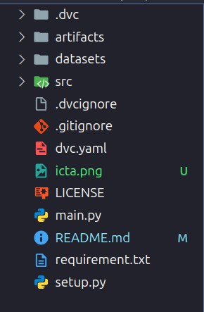

# An automatic machine learning based customer segmentation model with RFM analysis at ICTA conference 2024

* *Information about ICTA conference:* *https://icta.hvu.edu.vn/*

* *Link paper:* 

* *Link datasets:*

## Install Hadoop and Spark

First, you need to install Hadoop and Spark tools. Follow the installation instructions below:

+ [Installing latest Hadoop 3.4 on Ubuntu 2024](https://medium.com/@nsidana123/installing-latest-hadoop-3-4-on-ubuntu-2024-easy-installation-guide-874f889fede7)

+ [How to Install Spark on Ubuntu](https://medium.com/@redswitches/how-to-install-spark-on-ubuntu-965266d290d6)


## Environments Setup
### 1. Create Environments

Create virtual environments to ensure that libraries between applications do not conflict.You can create virtual environments anywhere you want. Using `python` for Window or `python3` for Linux.

```bash
$ python3 -m venv demo-project
$ cd demo-project
$ source bin/activate
```
### 2. Download Source Code
Download repo from github to local using command:

```bash
$ git clone https://github.com/nthaihoc/segmentation-customer-hadoop-spark-mlops-icta-2024.git
```

### 3. Install Library Dependencies 

You need to install the necessary libraries to manage and run the application. Using `pip` for Window or `pip3` for Linux.

```bash
$ cd segmentation-customer-hadoop-spark-mlops-icta-2024
$ pip3 install -r requirements.txt
```

### 4. Folder Structure

There are some important files as `artifacts`, `src` and `dvc.yaml`.

+ `artifact` include model and results file
+ `src` include source code of application
+ `dvc.yaml` is a configuration file, supporting automatic command line execution, for building and managing pipelines

See more infomation about `dvc`: https://dvc.org/

<div style="text-align: center;">
    
</div>

### 5. Start Pipeline

After successfully installing all the above steps, run the following command to start testing the application.

```bash
$ dvc repro
```

## Materials